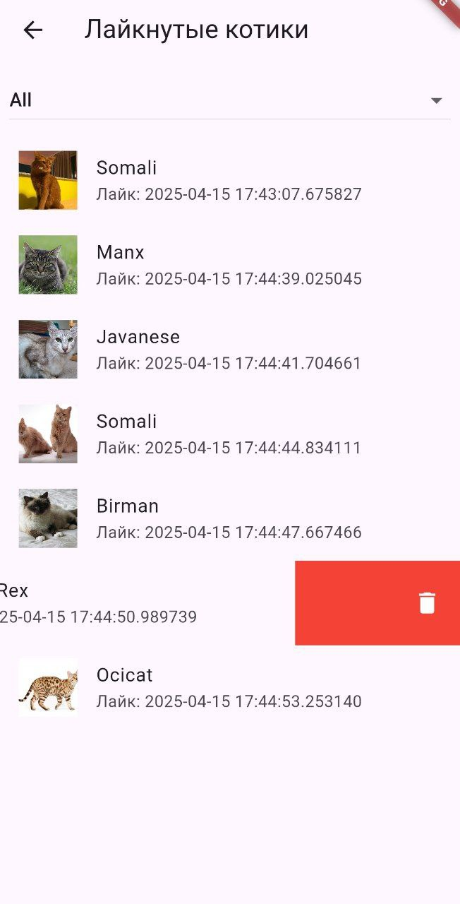
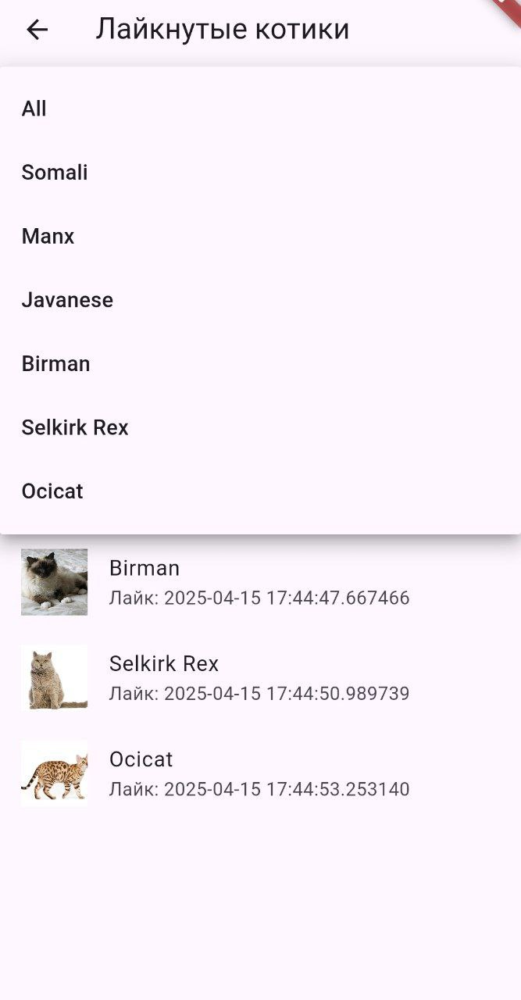
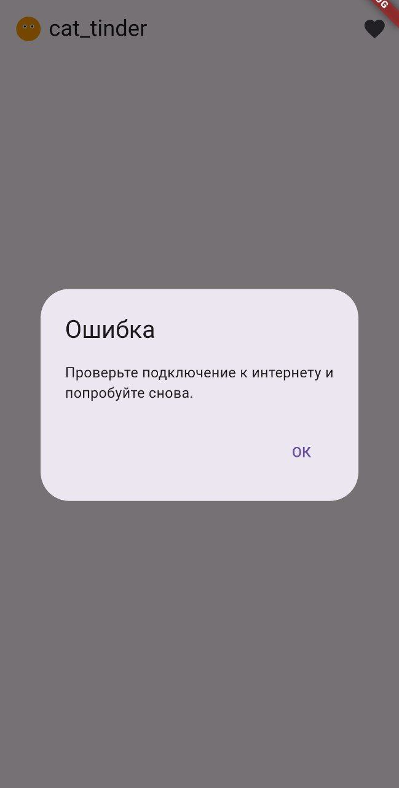

# Кототиндер

## Описание проекта
Кототиндер — это мобильное приложение на Flutter, которое позволяет пользователям просматривать случайные изображения котиков и ставить им лайки или дизлайки. При свайпе или нажатии на кнопки происходит загрузка нового котика. Также есть возможность открыть детальный экран с дополнительной информацией о породе.

## Скриншоты


/Users/matveitulin/Documents/Flutter/cat_tinder/assets/photo_2025-03-20_22-03-11.jpg





## Реализованные фичи
- На главном экране отображается случайное изображение котика и название его породы.
- Картинку можно свайпнуть влево или вправо.
- Две кнопки: лайк и дизлайк.
- При свайпе или нажатии на кнопку загружается новый котик.
- Счётчик лайков увеличивается при лайке (или свайпе вправо).
- При нажатии на изображение открывается экран с детальной информацией.
- На экране детального описания отображается картинка и описание породы.
  - Использован пакет `http` для запроса к API `https://thecatapi.com`.
- Кастомная иконка для приложения.
- Код отформатирован с помощью `dart format`, подключен `flutter_lint`.
- Обработка ошибок сети с диалогом.
- При длительной загрузке приложение показывает progress bar.
- Экран списка лайкнутых котиков (хранится в рантайме):
  - Отображение изображения, породы и даты лайка
  - Удаление котика из списка (свап в лево строки)
  - Фильтрация по породе с мгновенным обновлением

## Установка и запуск
1. Скачайте и установите Flutter SDK.
2. Клонируйте репозиторий:
   ```bash
   git clone https://github.com/m-tln/cat_tinder
   ```
3. Перейдите в папку проекта:
   ```bash
   cd cat_tinder
   ```
4. Установите зависимости:
   ```bash
   flutter pub get
   ```
5. Запустите приложение на эмуляторе или реальном устройстве:
   ```bash
   flutter run
   ```

## Скачать APK

## Технологии
- **Flutter** — для разработки UI.
- **Dart** — основной язык программирования.
- **Navigator** — для переходов между экранами.
- **http** — для работы с API.
- **Image.network** — для загрузки картинок из интернета.